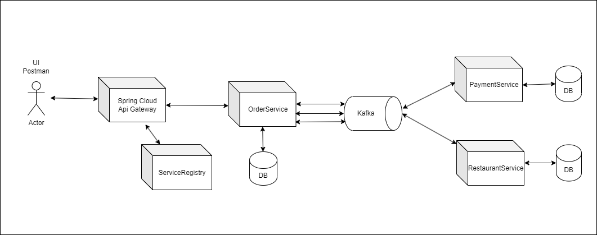

# Restaurant-cloud

Приложение работы ресторана.

1) Микросервисное приложение с использованием Spring Cloud.
2) Реализованы Order-service, Payment-service, Restaurant-service с минимальной бизнес-логикой.
3) В приложении применены следующие шаблоны:
- API шлюз;
- Служба обнаружения сервисов;
- Saga;
- Прерыватель;
- Распределенная трассировка;
- Агрегация логов.
4) Связь между сервисами осуществляется через REST, Kafka.
5) У каждого микросервиса своя СУБД (PostgreSQL).
6) Запуск через docker-compose.
7) Используемые технологии: Java 17, Spring Boot, Spring Cloud, Mapstruct, Kafka, Rabbit, Docker, OpenApi

Схема взаимодействия микросервисов:

